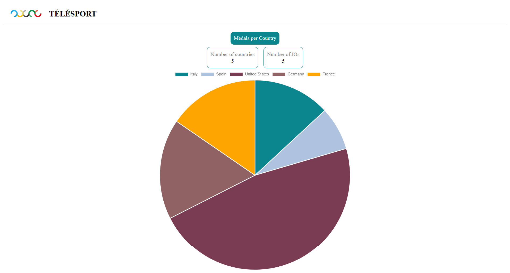
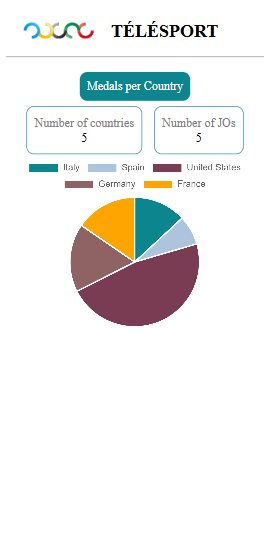
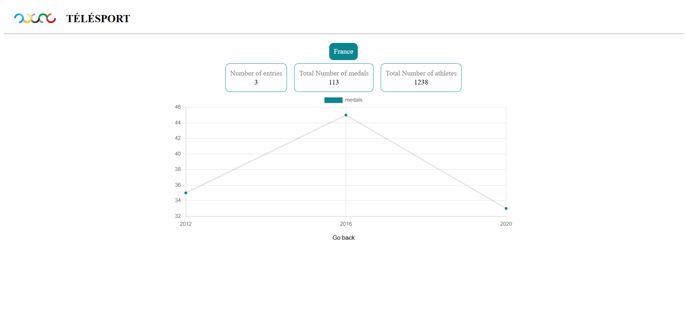
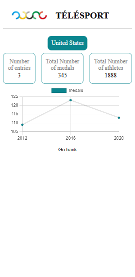
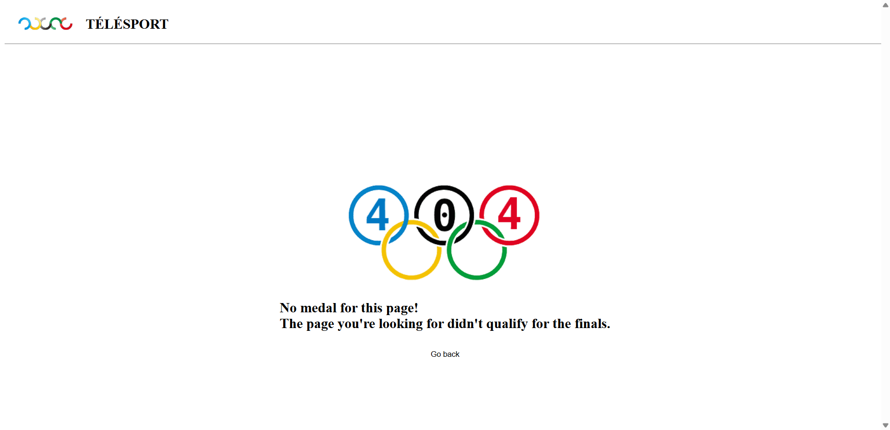
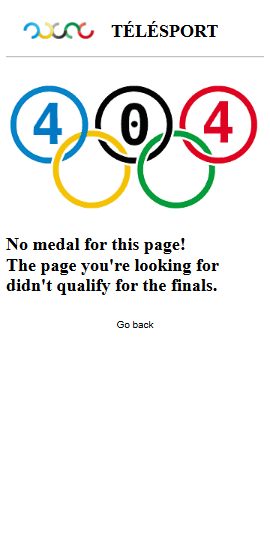

# Télésport Olympic Game Application

An Angular application for viewing and comparing Olympic performance data.

## Summary

1. [Technologies](#technologies)
2. [Launch application](#launch-application)
3. [Code Quality](#code-quality)
4. [Architecture](#architecture)
5. [Screenshots](#screenshots)

---

## Technologies

- Angular 21.2
- TypeScript
- SCSS
- Chart.js

---

## Launch application

### App installation

```bash
npm install
```

## Launch app

```bash
npm run start
```

---

## Code Quality

The project uses linting and formatting tools to ensure clean, consistent, and maintainable code.

### Angular Lint

Angular provides linting capabilities to detect code quality issues and enforce best practices.

Run Angular lint:

```bash
ng lint
```

### ESLint

ESLint is used to analyze TypeScript and Angular code.

Available commands:

#### Check code quality:

```bash
ng lint
# or
eslint .
```

#### Automatically fix lint issues:

```bash
npm run lint:fix

# or

eslint . --fix
```

### Prettier

Prettier is used to automatically format the code and maintain consistent styling.

Available commands:

#### Format the project

```bash
npm run format

# or

prettier . --write
```

#### Check formatting without modifying files

```bash
npm run format:check
# or
prettier . --check
```

---

## Architecture

```text
src/app
├── core
├── shared
├── feature
```

For the project architecture, please refer to the file describing the [architecture](ARCHITECTURE.md)

## Screenshots

### Home page





### Country page





### 404 page




