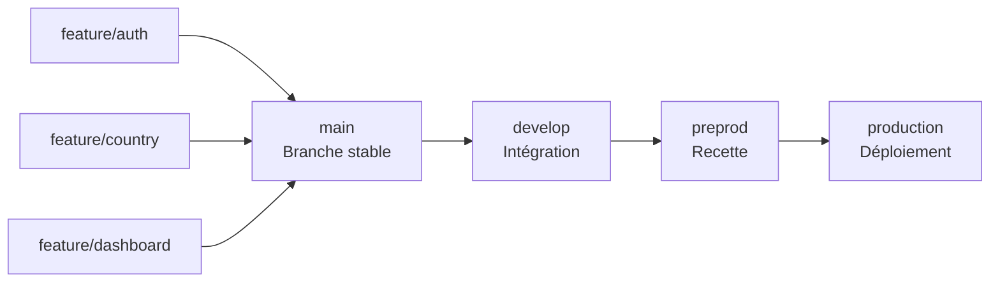

# Notes d'architecture

## 1. Erreurs ou améliorations dans les fichiers

### 1.1. Observations générales du code et améliorations

#### Constats actuels

##### Centralisation des appels API

Les requêtes HTTP sont actuellement implémentées directement dans les composants
(home.component.ts et country.component.ts). Cette approche mélange la logique
de récupération des données avec la logique de présentation.

Les appels API devraient être externalisés dans des services dédiés afin de
respecter la séparation des responsabilités et de faciliter la maintenance.

##### Typage des données

Les composants `home.component.ts` et `country.component.ts` utilisent actuellement
des types any pour manipuler les données provenant des API.

Cette pratique réduit fortement les bénéfices de TypeScript en supprimant la vérification
statique des types et augmente le risque d'erreurs lors des évolutions de l'application.

La création de modèles dédiés pour chaque type de donnée permettrait d'assurer un contrat
clair entre les sources de données et l'application.

##### Respect des principes d'architecture

La logique présente dans les composants `home.component.ts` et `country.component.ts`
ne respecte pas les bonnes pratiques Angular.

Plusieurs responsabilités sont actuellement regroupées dans les mêmes fichiers :

- récupération des données via API ;
- transformation des données ;
- gestion de la navigation ;
- création et configuration des graphiques ;
- gestion de la présentation.

Cette organisation constitue un anti-pattern car elle ne respecte pas notamment
le principe SOLID - Single Responsibility Principle (SRP) : un composant devrait avoir
une responsabilité unique et rester focalisé sur la gestion de son affichage.

#### Solutions proposées

##### Externaliser les appels API dans des services singleton

La création de services Angular dédiés aux appels API permet de :

- centraliser la logique d'accès aux données ;
- éviter la duplication de code ;
- améliorer la testabilité ;
- réduire le couplage entre l'interface utilisateur et les sources de données ;
- préparer l'application à des évolutions futures (gestion d'erreurs, cache, authentification, retry...).

##### Introduire des modèles de données

La création de modèles dédiés permet de :

- garantir un typage fort ;
- supprimer l'utilisation de any ;
- sécuriser les échanges entre les différentes couches applicatives ;
- rendre la structure des données explicite ;
- faciliter les évolutions futures de l'application.

##### Extraire la logique des graphiques dans un composant dédié

La gestion des graphiques Chart.js ne devrait pas être portée par les composants métier.

La création d'un composant dédié aux charts permet de :

- découpler la couche de visualisation de la logique métier ;
- simplifier les composants parents ;
- améliorer la réutilisation ;
- faciliter les tests ;
- permettre le remplacement ou l'évolution de la librairie graphique.

##### Extraire le header dans un composant autonome

Le header devrait être isolé dans un composant dédié afin de :

- respecter le principe de séparation des responsabilités ;
- réduire le couplage avec le composant racine ;
- favoriser la réutilisation ;
- faciliter les tests et les évolutions futures.

##### Externaliser les URLs serveur dans les environnements

Les URLs des services backend ne devraient pas être écrites en dur dans les composants ou services.

Elles doivent être déplacées dans les fichiers environment afin de :

- gérer facilement les différences entre environnements (développement, recette, production) ;
- éviter les modifications de code lors des déploiements ;
- centraliser la configuration applicative.

##### Suppression de polyfills.ts

Le fichier :

```bash
src/polyfills.ts
```

n'est plus nécessaire dans une application Angular moderne (Angular 17+ et versions futures)
dans la majorité des cas.

Angular gère désormais nativement les besoins de compatibilité via la configuration moderne du
build et du navigateur cible (browserslist).

La suppression de ce fichier permet de simplifier la structure du projet et d'éviter de maintenir
des dépendances historiques inutiles.

#### Synthèse

La refactorisation proposée vise à rapprocher l'application des standards Angular actuels :

- composants plus simples et spécialisés ;
- services dédiés aux responsabilités métier ;
- typage fort grâce aux modèles TypeScript ;
- meilleure testabilité ;
- réduction du couplage ;
- architecture plus évolutive et maintenable.

## 2 Exécution des tests

```bash
⠋ Generating browser application bundles (phase: setup)...    TypeScript compiler options "target" and "useDefineForClassFields" are set to "ES2022" and "false" respectively by the Angular CLI. To control ECMA version and features use the Browserslist configuration. For more information, see https://angular.dev/tools/cli/build#configuring-browser-compatibility
    NOTE: You can set the "target" to "ES2022" in the project's tsconfig to remove this warning.
✔ Browser application bundle generation complete.

Error: src/app/app.component.spec.ts:26:16 - error TS2339: Property 'title' does not exist on type 'AppComponent'.

26     expect(app.title).toEqual('olympic-games-starter');
                  ~~~~~


16 07 2026 09:41:07.980:WARN [karma]: No captured browser, open http://localhost:9876/
16 07 2026 09:41:08.004:INFO [karma-server]: Karma v6.4.4 server started at http://localhost:9876/
16 07 2026 09:41:08.004:INFO [launcher]: Launching browsers Chrome with concurrency unlimited
16 07 2026 09:41:08.011:INFO [launcher]: Starting browser Chrome
16 07 2026 09:41:09.095:INFO [Chrome 150.0.0.0 (Windows 10)]: Connected on socket RhKY9ZWC5uZx17hFAAAB with id 47351365
16 07 2026 09:41:09.138:WARN [web-server]: 404: /_karma_webpack_/main.js
Chrome 150.0.0.0 (Windows 10): Executed 0 of 0 SUCCESS (0.007 secs / 0 secs)
TOTAL: 0 SUCCESS
```

Erreur TypeScript :

- dans les tests le fichier `app.component.ts` est sensé avoir une propriété `title` mais elle est absente.

Les tests ne sont pas en adéquation avec le code fournis ce qui casserait l'exécution d'une CI/CD lors d'une tentative de déploiement déploiement.

---

---

### 3. UI

Adaptation responsive des graphiques

Sur les formats tablette et mobile, le graphique présent sur la page d'accueil occupe une place trop réduite par rapport aux éléments environnants (badges, indicateurs et boutons).

Le ratio actuel entre les composants ne permet pas une lecture optimale des données.

Plusieurs améliorations peuvent être envisagées :

revoir la gestion de la hauteur et largeur du container du graphique ;
utiliser une grille responsive (CSS Grid ou Flexbox) adaptée aux différentes résolutions ;
permettre au graphique d'occuper davantage d'espace vertical sur mobile ;
adapter les options Chart.js selon la taille de l'écran ;
réduire certains éléments secondaires lorsque l'espace est limité.

Le graphique étant le support principal de visualisation des données, il doit conserver une taille suffisante pour rester exploitable sur les petits écrans.

---

## 2. Git

### 2.1. Constatations du epo Github

Une seule branche est visible sur le repo, je préconnise pour le travail en équipe de fonctionner comme suit :

## 2.2 Mise en place de conventions git

Proposition de workflow git



- Une stratégie de convention de nommage clarifiera le repository :

Convention de création des branches et des commits

Chaque branche de fonctionnalité (feature) doit obligatoirement être créée à partir de la branche main.

Le nom de la branche doit correspondre au titre de l’User Story (US) associée afin de garantir une traçabilité claire entre le besoin métier et l'implémentation technique.

Exemple :

feature/US-123-add-country-page

La convention de nommage des commits doit reprendre le nom de la branche, suivi du caractère : puis d'une description concise de la modification réalisée.

Format :

nom-de-la-branche: description du changement

Exemple :

US-123-add-country-page: add country participation component

Cette convention permet :

d’identifier rapidement l’origine d’une modification ;
de faciliter le suivi entre les User Stories, les branches et l’historique Git ;
d’améliorer la lisibilité des commits lors des revues de code et des recherches dans l’historique.

## 2. Git

### 2.1. Analyse du repository GitHub

L'analyse du repository GitHub met en évidence qu'une seule branche est actuellement présente.

Cette organisation peut convenir pour un projet individuel ou une phase de démarrage, mais elle devient rapidement limitée dans un contexte de développement collaboratif.

Afin d'améliorer la collaboration entre les développeurs, de sécuriser les livraisons et de faciliter le suivi des évolutions, il est recommandé de mettre en place une stratégie de branches adaptée au travail en équipe.

### 2.2. Mise en place de conventions Git

#### Proposition de workflow Git


Cette organisation permet de séparer les différentes phases du cycle de développement :

- feature/ : développement des nouvelles fonctionnalités isolées ;
- main : branche contenant une version stable du code validé ;
- develop : branche d'intégration permettant de regrouper les développements avant validation (usage : run);
- preprod : environnement de recette destiné aux tests fonctionnels (usage build & run) ;
- production : branche correspondant aux versions déployées.

#### Convention de nommage des branches et des commits

La mise en place de conventions Git permet d'améliorer la lisibilité du repository et d'assurer une meilleure traçabilité entre les besoins métier et les modifications techniques.

##### Création des branches

Chaque branche dédiée à une fonctionnalité doit être créée à partir de la branche de référence définie par l'équipe.

Le nom de la branche doit reprendre l'identifiant de la User Story (US) associée ainsi qu'une description explicite de la fonctionnalité développée.

Format recommandé :

```
feature/US-XXX-description-fonctionnalite
```

Exemple :

```
feature/US-123-add-country-page
```

Cette convention permet de retrouver rapidement :

- le besoin métier associé ;
- l'objectif de la branche ;
- l'ensemble des modifications réalisées pour une fonctionnalité donnée.

##### Convention des messages de commit

Les messages de commit doivent suivre une convention commune afin de rendre l'historique Git plus lisible et exploitable.

Format recommandé :

nom-de-la-branche: description concise du changement

Exemple :

US-123-add-country-page: add country participation component

Un commit doit décrire une modification précise et cohérente, en évitant les messages trop génériques tels que :

```
fix
update
modification
changes
```

##### Bénéfices attendus

Cette convention permet de :

- identifier rapidement l'origine d'une modification ;
- faciliter le lien entre les User Stories, les branches et les commits associés ;
- améliorer la compréhension de l'historique Git ;
- simplifier les revues de code ;
- faciliter les recherches lors d'une correction ou d'une régression ;
- améliorer la collaboration entre les membres de l'équipe.

##### Recommandation complémentaire

Pour renforcer ce workflow, il est également conseillé d'ajouter :

- des Pull Requests obligatoires avant fusion dans main ;
- une validation par revue de code ;
- une protection des branches critiques (main, production) ;
- une exécution automatique des tests et du linting via une CI/CD avant merge.

Cette organisation permettra d'obtenir un cycle de développement plus fiable, plus traçable et plus adapté à un fonctionnement d'équipe.

## 3. Qualité du code : ESLint et Prettier

### 3.1. Mise en place d'ESLint

ESLint est un outil d'analyse statique permettant d'identifier les problèmes potentiels dans le code avant son exécution.

Son intégration dans le projet permet de :

- détecter les erreurs et incohérences lors du développement ;
- appliquer des règles communes et des standards de qualité ;
- encourager l'utilisation des bonnes pratiques TypeScript et Angular ;
- réduire les risques de régression liés à des erreurs de code ;
- améliorer la maintenabilité et la lisibilité du projet ;
- faciliter la collaboration entre développeurs grâce à des règles partagées.

L'utilisation d'ESLint permet également d'automatiser certains contrôles lors des revues de code et de garantir une homogénéité du code produit par l'équipe.

Exemples de contrôles apportés :

- détection des variables inutilisées ;
- contrôle du typage TypeScript ;
- identification des mauvaises pratiques Angular ;
- prévention de l'utilisation abusive de any ;
- respect des conventions de nommage.

### 3.2. Mise en place de Prettier

Prettier est un outil de formatage automatique du code permettant d'appliquer un style uniforme à l'ensemble du projet.

Son utilisation permet de :

- formater automatiquement le code selon une configuration commune ;
- supprimer les débats liés au style lors des revues de code ;
- garantir une présentation homogène entre les fichiers ;
- réduire les différences inutiles dans les commits ;
- limiter les conflits Git liés uniquement au formatage.

Prettier agit en complément d'ESLint :

- ESLint contrôle la qualité et les règles techniques du code ;
- Prettier garantit la cohérence de sa présentation.

### 3.3. Bénéfices pour l'équipe

L'association d'ESLint et Prettier permet de mettre en place une base de développement plus fiable :
- un code plus homogène et plus facile à maintenir ;
- des erreurs détectées plus tôt dans le cycle de développement ;
- des revues de code plus efficaces, centrées sur la logique métier plutôt que sur le style ;
- une meilleure collaboration entre développeurs ;
- une réduction de la dette technique sur le long terme.

---

---

## 3 Architecture

Il serait juditieux de passer l'application à un découpage modulaires, le but etant de maintenir plus aisaiment une application grandissante.
Selon la taille de l'application voulue ou future, il serait bien de mettre en place une artchitecture en "feature modules"

Architecture existante :

```text
src
├── app
│   ├── pages
│   │   ├── country
│   │   ├── home
│   │   └── not-found
│   │
│   ├── app-routing.module.ts
│   ├── app.component.html
│   ├── app.component.scss
│   ├── app.component.spec.ts
│   ├── app.component.ts
│   └── app.module.ts
│
├── assets
│   ├── images
│   └── mock
│
├── environments
│   ├── environment.ts
│   └── environment.prod.ts
│
├── favicon.ico
├── app.html (renaming of index.html)
├── app.ts (renaming of main.ts)
├── polyfills.ts
├── styles.scss
└── test.ts
```

Architecture suggérée
Idéal pour l'évolution future (coller a l'architecture naturelle modulaire d'Angular) :

```text
src
├── app
│   ├── core
│   │   ├── components
│   │   │   ├── header
│   │   │   └── not-found
│   │   ├── models
│   │   └── services
│   │
│   ├── pages (ou features)
│   │   ├── home
│   │   │   ├── components
│   │   │   ├── home.component.ts
│   │   │   ├── home.component.html
│   │   │   ├── home.component.scss
│   │   │   └── home.routes.ts
│   │   │
│   │   ├── country
│   │   │   ├── components
│   │   │   │   ├── country-card
│   │   │   │   └── participation-chart
│   │   │   │   └── country-header
│   │   │   ├── country.component.ts
│   │   │   ├── country.component.html
│   │   │   ├── country.component.scss
│   │   │   └── country.routes.ts
│   │
│   ├── app.component.ts
│   ├── app.component.html
│   ├── app.component.scss
│   ├── app.routes.ts
│   └── app.config.ts
│
├── assets
│   ├── images
│   └── mock
│
├── environments
│   ├── environment.ts
│   └── environment.prod.ts
│
├── favicon.ico
├── index.html
├── main.ts
├── polyfills.ts (remove)
├── styles.scss
└── test.ts
```

Vu qu'un refactor est organisé, pourquoi ne pas partir d'une page blanche et porter ce qui est actuellement fait dans une architecture modulaire sur la dernière version lts d'Angular.
Tant qu'il n'y a pas beaucoup de code c'est faisable proprement sans organiser de migration qui prendraient beaucoup trop de temps.

## 4 Upgrade socle applicatif

Profiter du refactor pour upgrader Angular de la version 18.0.6 à la dernière version lts 21.
Cela n'est pas necessaire mais ces raisons sont à prendre en considération tant que l'application n'est pas très fournie :

- Sécurité et maintien du support

Maintenir une version Angular supportée permet de garantir l'application des correctifs de sécurité et de réduire l'exposition aux vulnérabilités connues.

- Réduction de la dette technique

Migrer régulièrement réduit le coût global de maintenance et évite une migration majeure difficile à planifier.

- Amélioration des performances

Les optimisations du framework permettent d'améliorer les performances perçues par les utilisateurs sans modification fonctionnelle majeure.

- Évolution du système de réactivité

L'évolution vers les Signals prépare l'application aux architectures Angular modernes et améliore la maintenabilité.

- Meilleure expérience développeur

Une version récente du framework améliore la productivité des équipes de développement.

- Compatibilité avec l'écosystème

Maintenir Angular à jour garantit la compatibilité avec les composants tiers et réduit les blocages lors des évolutions fonctionnelles.

- Amélioration de la qualité du code

Les nouvelles pratiques Angular permettent d'avoir un code plus lisible, testable et maintenable.

- Préparation future

Maintenir l'application proche de la roadmap officielle réduit le risque technologique à long terme.

> Conclusion :
>
> La migration Angular 18 vers Angular 21 permet de maintenir l'application dans un environnement supporté, sécurisé et compatible avec l'écosystème actuel, tout en réduisant la dette technique et en préparant l'évolution future de l'architecture frontend.

## 5. Evolution

### 5.1 Translations

Si le site est voué a être multilangue mettre en place `i18n` maintenant serait une bonne idée pour les traductions et éviter la dette technique
