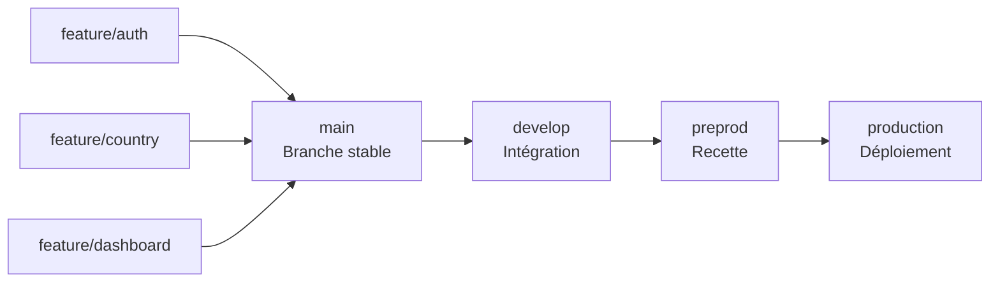

# Notes d'architecture

## 1. Erreurs ou améliorations dans les fichiers

### 1.1. Observations générales du code

Les requêtes sont codées dans les components et devraient être codées dans des services dédié.

Il n'y a que des typages en any dans `home.component.ts` et `country.component.ts`, ce qui ne sécurise pas l'applicatif.

Utiliser
mettre variable server url dans environments

Le fichier `src/polyfills.ts` n'est absolument pas necessaire dans la version actuelle ou les versions futures d'angular.

### 1.2 Exécution des tests

```bash
⠋ Generating browser application bundles (phase: setup)...    TypeScript compiler options "target" and "useDefineForClassFields" are set to "ES2022" and "false" respectively by the Angular CLI. To control ECMA version and features use the Browserslist configuration. For more information, see https://angular.dev/tools/cli/build#configuring-browser-compatibility
    NOTE: You can set the "target" to "ES2022" in the project's tsconfig to remove this warning.
✔ Browser application bundle generation complete.

Error: src/app/app.component.spec.ts:26:16 - error TS2339: Property 'title' does not exist on type 'AppComponent'.

26     expect(app.title).toEqual('olympic-games-starter');
                  ~~~~~


16 07 2026 09:41:07.980:WARN [karma]: No captured browser, open http://localhost:9876/
16 07 2026 09:41:08.004:INFO [karma-server]: Karma v6.4.4 server started at http://localhost:9876/
16 07 2026 09:41:08.004:INFO [launcher]: Launching browsers Chrome with concurrency unlimited
16 07 2026 09:41:08.011:INFO [launcher]: Starting browser Chrome
16 07 2026 09:41:09.095:INFO [Chrome 150.0.0.0 (Windows 10)]: Connected on socket RhKY9ZWC5uZx17hFAAAB with id 47351365
16 07 2026 09:41:09.138:WARN [web-server]: 404: /_karma_webpack_/main.js
Chrome 150.0.0.0 (Windows 10): Executed 0 of 0 SUCCESS (0.007 secs / 0 secs)
TOTAL: 0 SUCCESS
```

Erreur TypeScript :

- dans les tests le fichier `app.component.ts` est sensé avoir une propriété `title` mais elle est absente

### 1.3. Repo Github

Une seule branche est visible sur le repo, je préconnise pour le travail en équipe de fonctionner comme suit :

---

---

### 1.4. UI

Extraire le header dans une navbar ou un headerbar même si ce n'est qu'un h2 et qu'il soit repercuté sur tous les autres components dans le app.component

Exporter chaque graphisque dans un composant dédié garantirait la réemployabilité du code et pas sa dupplication.

En version mobile et tablette le graphique de la home est vraiment petit comparé aux badges et aux boutons

---

## 2. Améliorations structurelles

## 2.1 Conventions git

Proposition de workflow git



- Une stratégie de convention de nommage clarifiera le repository :

Convention de création des branches et des commits

Chaque branche de fonctionnalité (feature) doit obligatoirement être créée à partir de la branche main.

Le nom de la branche doit correspondre au titre de l’User Story (US) associée afin de garantir une traçabilité claire entre le besoin métier et l'implémentation technique.

Exemple :

feature/US-123-add-country-page

La convention de nommage des commits doit reprendre le nom de la branche, suivi du caractère : puis d'une description concise de la modification réalisée.

Format :

nom-de-la-branche: description du changement

Exemple :

US-123-add-country-page: add country participation component

Cette convention permet :

d’identifier rapidement l’origine d’une modification ;
de faciliter le suivi entre les User Stories, les branches et l’historique Git ;
d’améliorer la lisibilité des commits lors des revues de code et des recherches dans l’historique.

## 2.2. Linters

Eslint

- Détecter les erreurs avant l'exécution
- Uniformiser les bonnes pratiques
- Améliorer la qualité du code
- Faciliter le travail en équipe

Prettier

- Formater automatiquement le code
- Uniformiser le style
- Réduire les conflits Git

---

---

## 2.3 Architecture

Il serait juditieux de passer l'application à un découpage modulaires, le but etant de maintenir plus aisaiment une application grandissante.
Selon la taille de l'application voulue ou future, il serait bien de mettre en place une artchitecture en "feature modules"

Architecture existante :

```text
src
├── app
│   ├── pages
│   │   ├── country
│   │   ├── home
│   │   └── not-found
│   │
│   ├── app-routing.module.ts
│   ├── app.component.html
│   ├── app.component.scss
│   ├── app.component.spec.ts
│   ├── app.component.ts
│   └── app.module.ts
│
├── assets
│   ├── images
│   └── mock
│
├── environments
│   ├── environment.ts
│   └── environment.prod.ts
│
├── favicon.ico
├── app.html (renaming of index.html)
├── app.ts (renaming of main.ts)
├── polyfills.ts
├── styles.scss
└── test.ts
```

Architecture suggérée
Idéal pour l'évolution future (coller a l'architecture naturelle modulaire d'Angular) :

```text
src
├── app
│   ├── core
│   │   ├── components
│   │   │   ├── header
│   │   │   └── not-found
│   │   ├── models
│   │   └── services
│   │
│   ├── pages (ou features)
│   │   ├── home
│   │   │   ├── components
│   │   │   ├── home.component.ts
│   │   │   ├── home.component.html
│   │   │   ├── home.component.scss
│   │   │   └── home.routes.ts
│   │   │
│   │   ├── country
│   │   │   ├── components
│   │   │   │   ├── country-card
│   │   │   │   └── participation-chart
│   │   │   │   └── country-header
│   │   │   ├── country.component.ts
│   │   │   ├── country.component.html
│   │   │   ├── country.component.scss
│   │   │   └── country.routes.ts
│   │
│   ├── app.component.ts
│   ├── app.component.html
│   ├── app.component.scss
│   ├── app.routes.ts
│   └── app.config.ts
│
├── assets
│   ├── images
│   └── mock
│
├── environments
│   ├── environment.ts
│   └── environment.prod.ts
│
├── favicon.ico
├── index.html
├── main.ts
├── polyfills.ts (remove)
├── styles.scss
└── test.ts
```

Vu qu'un refactor est organisé, pourquoi ne pas partir d'une page blanche et porter ce qui est actuellement fait dans une architecture modulaire sur la dernière version lts d'Angular.
Tant qu'il n'y a pas beaucoup de code c'est faisable proprement sans organiser de migration qui prendraient beaucoup trop de temps.

### 2.4 Upgrade socle applicatif

Profiter du refactor pour upgrader Angular de la version 18.0.6 à la dernière version lts 21.
Cela n'est pas necessaire mais ces raisons sont à prendre en considération tant que l'application n'est pas très fournie :

- Sécurité et maintien du support

Maintenir une version Angular supportée permet de garantir l'application des correctifs de sécurité et de réduire l'exposition aux vulnérabilités connues.

- Réduction de la dette technique

Migrer régulièrement réduit le coût global de maintenance et évite une migration majeure difficile à planifier.

- Amélioration des performances

Les optimisations du framework permettent d'améliorer les performances perçues par les utilisateurs sans modification fonctionnelle majeure.

- Évolution du système de réactivité

L'évolution vers les Signals prépare l'application aux architectures Angular modernes et améliore la maintenabilité.

- Meilleure expérience développeur

Une version récente du framework améliore la productivité des équipes de développement.

- Compatibilité avec l'écosystème

Maintenir Angular à jour garantit la compatibilité avec les composants tiers et réduit les blocages lors des évolutions fonctionnelles.

- Amélioration de la qualité du code

Les nouvelles pratiques Angular permettent d'avoir un code plus lisible, testable et maintenable.

- Préparation future

Maintenir l'application proche de la roadmap officielle réduit le risque technologique à long terme.

> Conclusion :
>
> La migration Angular 18 vers Angular 21 permet de maintenir l'application dans un environnement supporté, sécurisé et compatible avec l'écosystème actuel, tout en réduisant la dette technique et en préparant l'évolution future de l'architecture frontend.

## 3. Evolution

### 3.1 Translations

Si le site est voué a être multilangue mettre en place `i18n` maintenant serait une bonne idée pour les traductions et éviter la dette technique
